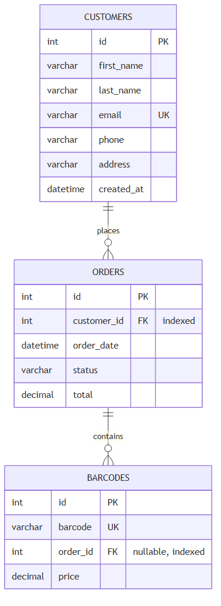
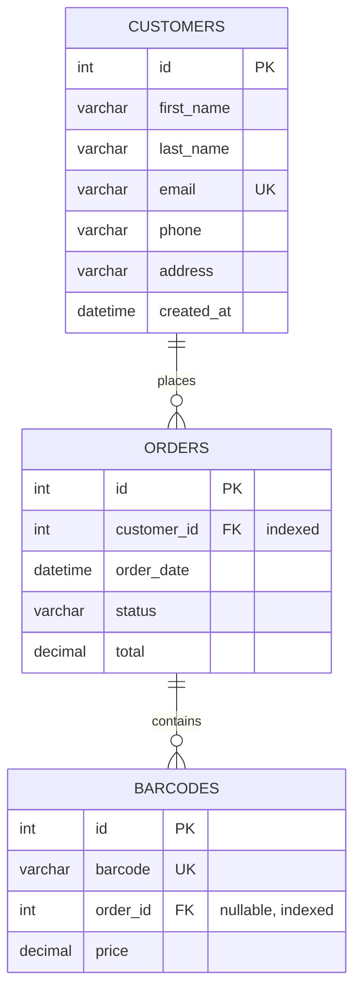
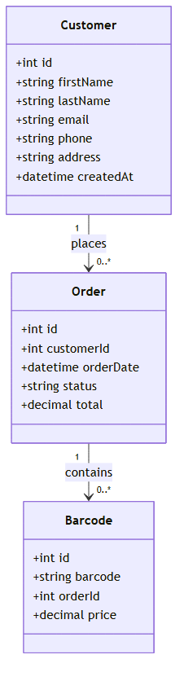
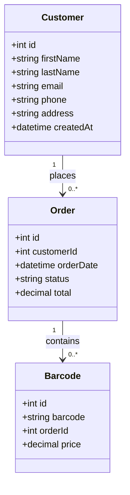

# SQL Data Model (Bonus)

Models how the CSV data (`orders.csv`, `barcodes.csv`) — plus reasonable real-world
customer/order fields not present in the CSVs — would be stored in a relational database.
Standard, vendor-neutral SQL only (no engine-specific extensions like `ENUM`), since no single
database engine was assumed for this bonus.

## Editing the diagrams

The Mermaid source is the single source of truth, kept in two places that must stay in sync:
`docs/erd.mmd` / `docs/uml-class.mmd` (standalone source files, used to regenerate the PNGs) and
the matching ` ```mermaid ` code blocks in this file (used for GitHub's native rendering).

To change a diagram:
1. Edit `docs/erd.mmd` or `docs/uml-class.mmd`.
2. Copy the same change into the matching code block further down in this file, so both stay
   identical.
3. Regenerate the PNG (requires Node.js — `@mermaid-js/mermaid-cli` is fetched on demand via
   `npx`, nothing to install ahead of time):
   ```
   npx -y @mermaid-js/mermaid-cli -i docs/erd.mmd -o docs/erd.png -b white
   npx -y @mermaid-js/mermaid-cli -i docs/uml-class.mmd -o docs/uml-class.png -b white
   ```
   `-b white` sets a white background (otherwise the PNG is transparent, which is hard to read
   over a dark viewer background).

## Tables

### `customers`

| Column | Type | Notes |
|---|---|---|
| `id` | `INT` | PK, auto-increment |
| `first_name` | `VARCHAR(100)` | |
| `last_name` | `VARCHAR(100)` | |
| `email` | `VARCHAR(255)` | `UNIQUE` |
| `phone` | `VARCHAR(20)` | string, not numeric — phone numbers can have `+`/leading `0`/formatting |
| `address` | `VARCHAR(255)` | flat text (not normalized into street/city/postal/country) |
| `created_at` | `DATETIME` | |

### `orders`

| Column | Type | Notes |
|---|---|---|
| `id` | `INT` | PK, auto-increment |
| `customer_id` | `INT` | FK → `customers.id`, `NOT NULL` — every order has exactly one customer |
| `order_date` | `DATETIME` | |
| `status` | `VARCHAR(20)` | `NOT NULL`, `CHECK (status IN ('pending', 'paid', 'cancelled'))` |
| `total` | `DECIMAL(10,2)` | stored (not derived), see Design Decisions |

### `barcodes`

| Column | Type | Notes |
|---|---|---|
| `id` | `INT` | PK, auto-increment |
| `barcode` | `VARCHAR(50)` | `UNIQUE NOT NULL` — string, not numeric, to preserve format/leading zeros (matches `Barcode.barcode: str` in `models/barcode.py`) |
| `order_id` | `INT` | FK → `orders.id`, **nullable** — `NULL` = unsold barcode (spec §3) |
| `price` | `DECIMAL(10,2)` | |

## Relationships

- `customers 1 ── * orders` (one customer, zero or many orders)
- `orders 1 ── * barcodes` (one order, zero or many barcodes)

Both are one-to-many, modeled with a plain foreign key on the "many" side. **No junction
tables** — a junction table (`customerOrder`, `ordersBarcodes`) is only correct for
many-to-many relationships, and neither relationship here is many-to-many: an order belongs to
exactly one customer, and a barcode belongs to at most one order.

## Indexes

```sql
CREATE INDEX idx_orders_customer_id ON orders(customer_id);
CREATE INDEX idx_barcodes_order_id ON barcodes(order_id);
```

Chosen to match the actual queries this program runs, not indexed speculatively:

- `orders.customer_id` — speeds grouping/summing tickets per customer (top-5-customers bonus
  stat).
- `barcodes.order_id` — speeds the join for the main grouping/output query, and the
  `WHERE order_id IS NULL` filter (unused-barcode-count bonus stat).

`barcodes.barcode` already gets an index for free from its `UNIQUE` constraint — no separate
index needed. FK columns are indexed explicitly rather than assumed, since not every engine
auto-indexes them (MySQL/InnoDB does; PostgreSQL does not).

## DDL

```sql
CREATE TABLE customers (
    id         INT PRIMARY KEY AUTO_INCREMENT,
    first_name VARCHAR(100),
    last_name  VARCHAR(100),
    email      VARCHAR(255) UNIQUE,
    phone      VARCHAR(20),
    address    VARCHAR(255),
    created_at DATETIME
);

CREATE TABLE orders (
    id          INT PRIMARY KEY AUTO_INCREMENT,
    customer_id INT NOT NULL,
    order_date  DATETIME,
    status      VARCHAR(20) NOT NULL CHECK (status IN ('pending', 'paid', 'cancelled')),
    total       DECIMAL(10,2),
    FOREIGN KEY (customer_id) REFERENCES customers(id)
);

CREATE TABLE barcodes (
    id       INT PRIMARY KEY AUTO_INCREMENT,
    barcode  VARCHAR(50) UNIQUE NOT NULL,
    order_id INT NULL,
    price    DECIMAL(10,2),
    FOREIGN KEY (order_id) REFERENCES orders(id)
);

CREATE INDEX idx_orders_customer_id ON orders(customer_id);
CREATE INDEX idx_barcodes_order_id ON barcodes(order_id);
```

## ERD





## UML class diagram (supplementary)





## Design decisions

- **No junction tables.** Both relationships (customer→orders, order→barcodes) are one-to-many
  per spec §3, not many-to-many — a plain FK on the "many" side is correct; a junction table
  would incorrectly *allow* one order to belong to multiple customers, or one barcode to belong
  to multiple orders, neither of which is valid in this domain.
- **Surrogate `id` PK on every table**, including `barcodes` (rather than using the `barcode`
  string itself as the PK) — for consistency across all three tables, even though `barcode` is
  already guaranteed unique.
- **`VARCHAR(20) CHECK (...)` instead of `ENUM` for `orders.status`** — `ENUM` is vendor-specific
  (native in MySQL, different syntax in Postgres, unsupported in SQL Server/Oracle/SQLite); a
  `CHECK` constraint gives the same DB-enforced validity without tying the schema to one engine.
- **`DECIMAL(10,2)`, not `FLOAT`/`DOUBLE`, for money** (`orders.total`, `barcodes.price`) —
  floating-point types introduce rounding errors that are unacceptable for currency.
- **`barcode` typed `VARCHAR`, not numeric** — even though sample values look numeric
  (`11111111111`), barcodes can have leading zeros or non-numeric formats in the real world;
  matches `Barcode.barcode: str` in the existing Python model.
- **`orders.total` stored, not derived** from `SUM(barcodes.price)` — a deliberate
  denormalization for fast reads without a join+aggregate on every order lookup, accepting the
  tradeoff that `total` could drift out of sync if a barcode's `price` changes after the order is
  placed.
- **Indexes added only for columns actually used by this program's queries** (`orders.customer_id`,
  `barcodes.order_id`) — not indexed speculatively on every column, since each index has a write
  cost (every `INSERT`/`UPDATE`/`DELETE` must also maintain the index) and a storage cost.
- **Columns beyond the two CSVs** (`customers.name`/`email`/`phone`/`address`, `orders.order_date`/
  `status`/`total`, `barcodes.price`) are a reasonable real-world extension of the CSV-only data —
  the CSVs only carry `order_id`/`customer_id`/`barcode`, but a real relational model for a
  ticketing system needs more than that to be useful.
