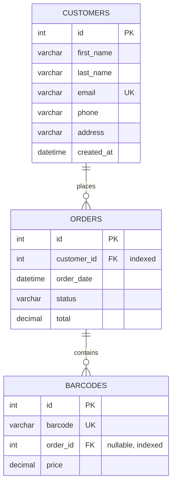

# SQL Data Model

Models how the CSV data (`orders.csv`, `barcodes.csv`) — plus reasonable real-world
customer/order fields not present in the CSVs — would be stored in a relational database.

## Editing the diagram

Source of truth: `docs/data-model/erd.mmd`, mirrored in the ` ```mermaid ` block below (for
GitHub's native rendering). To change it: edit `erd.mmd`, copy the change into the block below,
then regenerate the PNG:

```
npx -y @mermaid-js/mermaid-cli -i docs/data-model/erd.mmd -o docs/data-model/erd.png -b white
```

## Tables

### `customers`

| Column | Type | Notes |
|---|---|---|
| `id` | `INT` | PK, auto-increment |
| `first_name` | `VARCHAR(100)` | |
| `last_name` | `VARCHAR(100)` | |
| `email` | `VARCHAR(255)` | `UNIQUE` |
| `phone` | `VARCHAR(20)` | non-numeric |
| `address` | `VARCHAR(255)` | flat text |
| `created_at` | `DATETIME` | |

### `orders`

| Column | Type | Notes |
|---|---|---|
| `id` | `INT` | PK, auto-increment |
| `customer_id` | `INT` | FK → `customers.id`, `NOT NULL` |
| `order_date` | `DATETIME` | |
| `status` | `VARCHAR(20)` | `NOT NULL`, `CHECK (status IN ('pending', 'paid', 'cancelled'))` |
| `total` | `DECIMAL(10,2)` | stored, not derived — see Design Decisions |

### `barcodes`

| Column | Type | Notes |
|---|---|---|
| `id` | `INT` | PK, auto-increment |
| `barcode` | `VARCHAR(50)` | `UNIQUE NOT NULL` — non-numeric, see Design Decisions |
| `order_id` | `INT` | FK → `orders.id`, **nullable** — `NULL` = unsold barcode (spec §3) |
| `price` | `DECIMAL(10,2)` | |

## Relationships

- `customers 1 ── * orders`
- `orders 1 ── * barcodes`

Both one-to-many, modeled with a plain FK on the "many" side — no junction tables (see Design
Decisions).

## Indexes

```sql
CREATE INDEX idx_orders_customer_id ON orders(customer_id);
CREATE INDEX idx_barcodes_order_id ON barcodes(order_id);
```

Match this program's actual queries — grouping orders by customer, and filtering barcodes by
`order_id`.

## DDL

```sql
CREATE TABLE customers (
    id         INT PRIMARY KEY AUTO_INCREMENT,
    first_name VARCHAR(100),
    last_name  VARCHAR(100),
    email      VARCHAR(255) UNIQUE,
    phone      VARCHAR(20),
    address    VARCHAR(255),
    created_at DATETIME
);

CREATE TABLE orders (
    id          INT PRIMARY KEY AUTO_INCREMENT,
    customer_id INT NOT NULL,
    order_date  DATETIME,
    status      VARCHAR(20) NOT NULL CHECK (status IN ('pending', 'paid', 'cancelled')),
    total       DECIMAL(10,2),
    FOREIGN KEY (customer_id) REFERENCES customers(id)
);

CREATE TABLE barcodes (
    id       INT PRIMARY KEY AUTO_INCREMENT,
    barcode  VARCHAR(50) UNIQUE NOT NULL,
    order_id INT NULL,
    price    DECIMAL(10,2),
    FOREIGN KEY (order_id) REFERENCES orders(id)
);

CREATE INDEX idx_orders_customer_id ON orders(customer_id);
CREATE INDEX idx_barcodes_order_id ON barcodes(order_id);
```

## ERD




## Design decisions

- **`DECIMAL(10,2)`, not `FLOAT`/`DOUBLE`, for money** — avoids floating-point rounding errors.
- **`barcode` typed `VARCHAR`, not numeric** — preserves leading zeros/non-numeric formats;
  matches `Barcode.barcode: str` in `models/barcode.py`.
- **`orders.total` stored, not derived** from `SUM(barcodes.price)` — avoids a join+aggregate on
  every order lookup, trading off possible drift if a barcode's price changes later.
- **Indexes only on `orders.customer_id`/`barcodes.order_id`** — the columns this program's
  queries actually use.
- **Columns beyond the two CSVs** (`customers.*`, `orders.order_date`/`status`/`total`,
  `barcodes.price`) are illustrative examples of realistic ticketing-system fields for this ERD,
  not an exhaustive real-world schema.
